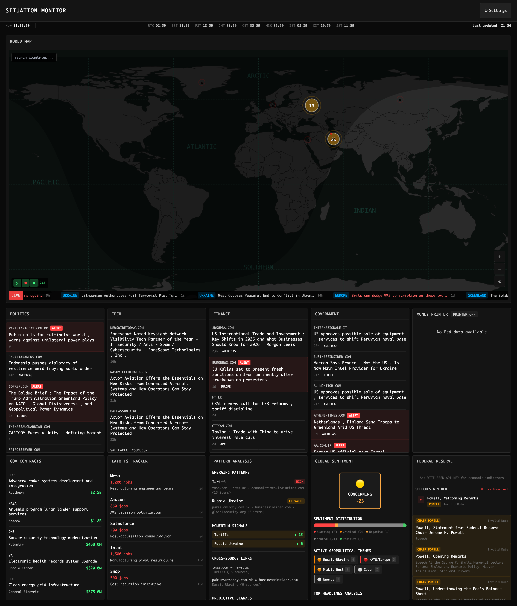

# Situation Monitor

A comprehensive real-time geopolitical intelligence platform that aggregates, analyzes, and visualizes global conflicts, developments, news, market data, and geopolitical events. Designed for analysts, researchers, traders, and anyone who needs to stay informed about world events as they unfold.



## Features

- 📰 **Multi-source News Aggregation** - Real-time news from Reuters, AP, Foreign Affairs, CSIS, Brookings, and more
- 📊 **Live Market & Commodity Data** - Stock prices, commodities, cryptocurrencies via Finnhub
- 🗺️ **Interactive Global Map** - Visual representation of conflicts and geopolitical hotspots
- ⚔️ **Real-time Conflict Tracking** - GDELT Project integration for conflict monitoring
- 🎯 **Sentiment & Narrative Analysis** - ML-powered analysis of news narratives and sentiment
- 🔔 **Custom Keyword Monitors** - Create alerts for specific topics and events
- 🌐 **World Leader Tracking** - Track statements and activities of key global figures
- 📈 **Pattern Correlation Analysis** - Discover correlations between events and market movements
- 🏦 **Federal Reserve Monitoring** - Economic indicators and Fed data integration
- 🤖 **Local AI Summarization** - Optional TinyLlama-powered news summarization via WebLLM

## Tech Stack

- **Frontend**: SvelteKit, TypeScript, Tailwind CSS
- **Build**: Vite, PostCSS
- **Testing**: Vitest, Playwright
- **Data Sources**: 
  - GDELT Project (conflicts)
  - Finnhub (financial data)
  - Federal Reserve FRED API (economic data)
  - Multiple news sources via proxy
- **AI**: WebLLM (optional, for local summarization)

## Getting Started

### Prerequisites

- Node.js 18+
- npm/pnpm

### Installation

```bash
# Clone the repository
git clone <repository-url>
cd situation-monitor

# Install dependencies
npm install

# Setup environment variables
cp .env.example .env
```

### Environment Configuration

Update `.env` with your API keys:

```env
VITE_FINNHUB_API_KEY=your_finnhub_key
VITE_FRED_API_KEY=your_fed_api_key
```

**Getting API Keys:**
- [Finnhub](https://finnhub.io/) - Free tier available
- [FRED API](https://fred.stlouisfed.org/docs/api/fred/) - Free from Federal Reserve

### Development

```bash
# Start dev server
npm run dev

# Run tests
npm test

# Run end-to-end tests
npm run test:e2e

# Build for production
npm run build

# Preview production build
npm run preview
```

## Project Structure

```
src/
├── lib/
│   ├── analysis/        # Sentiment, narrative, correlation analysis
│   ├── api/            # External API integrations
│   ├── components/     # Svelte components (panels, modals, layout)
│   ├── config/         # Application configuration
│   ├── services/       # Cache, circuit breaker, deduplication
│   ├── stores/         # Svelte stores (state management)
│   ├── types/          # TypeScript type definitions
│   └── utils/          # Utility functions
└── routes/             # SvelteKit routes
```

## Key Features Explained

### Panel System
The dashboard consists of configurable panels that can be enabled/disabled and reordered:
- News Panel
- Market Panel
- Fed Panel
- Heatmap Panel
- Conflict Map
- And more...

### Settings
Access dashboard settings to:
- Toggle panels on/off
- Reorder panels via drag-and-drop
- Switch between light/dark themes
- Enable experimental features (news summarization)
- Reset to default configuration

### Local AI (WebLLM)
Optional feature to summarize news articles using TinyLlama running locally in your browser. No external API calls needed for summarization.

## Data Sources

- **GDELT Project** - Global conflict and event data
- **Reuters, AP, Foreign Affairs, CSIS, Brookings** - News sources
- **War on the Rocks, Bellingcat, ISW** - Specialized geopolitical analysis
- **Finnhub** - Financial market data
- **Federal Reserve** - Economic indicators
- Additional verified intelligence sources

## Performance Features

- **Circuit Breaker** - Prevents cascading API failures
- **Request Deduplication** - Eliminates redundant API calls
- **Response Caching** - Reduces API usage and improves responsiveness
- **Request Registry** - Tracks in-flight requests to prevent duplicates

## Testing

```bash
# Unit tests
npm run test

# Watch mode
npm run test:watch

# E2E tests
npm run test:e2e

# Coverage
npm run test:coverage
```

## Disclaimer

⚠️ This tool is for informational purposes only. Always verify information through official sources before making decisions.


## Contributing

Contributions are welcome. Please ensure tests pass and code follows the existing style.

## Support

For issues, questions, or suggestions, please open an issue in the repository.

---

_Fork of [hipcityreg/situation-monitor](https://github.com/hipcityreg/situation-monitor)_

---

